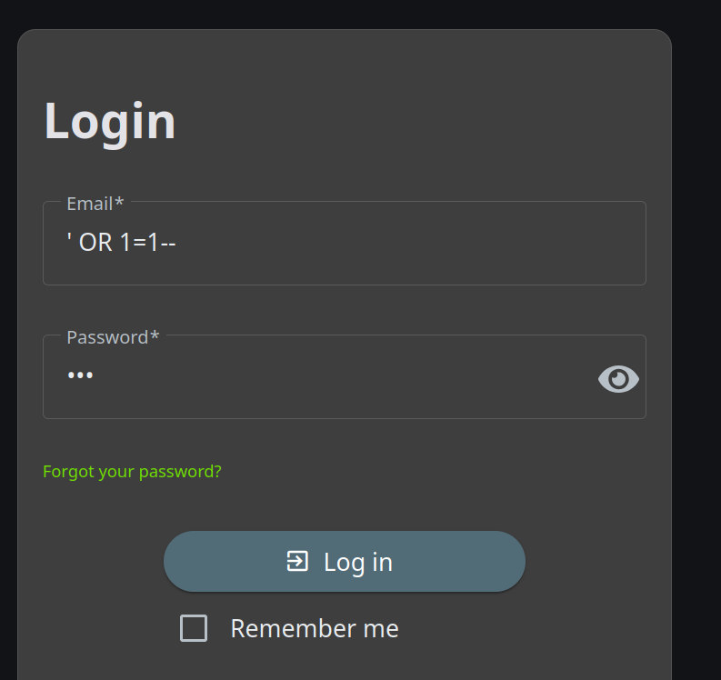
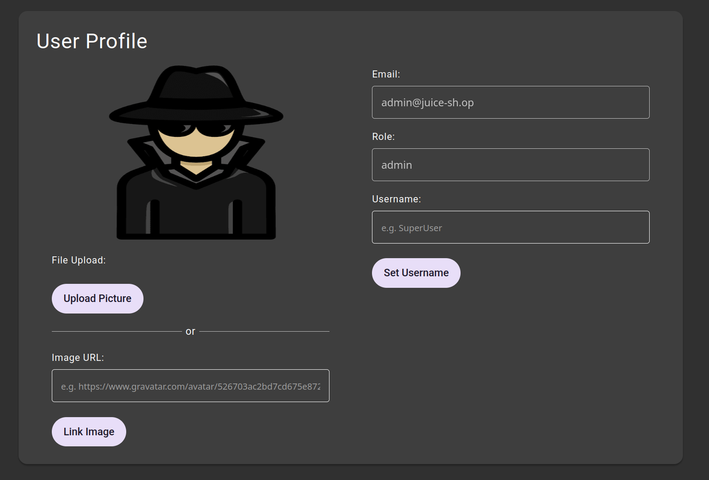
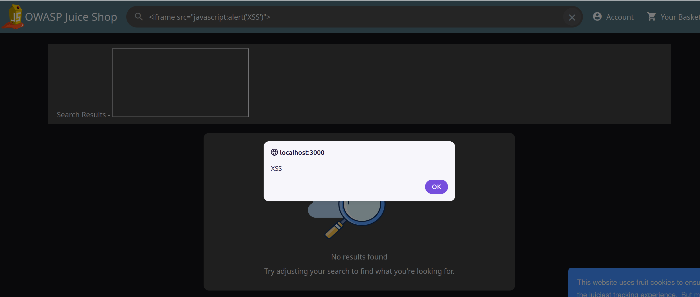
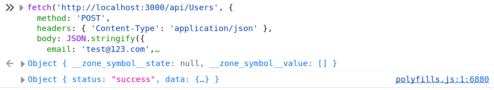
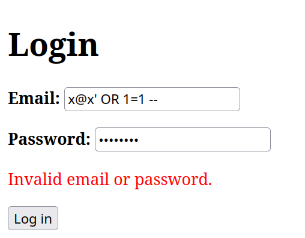
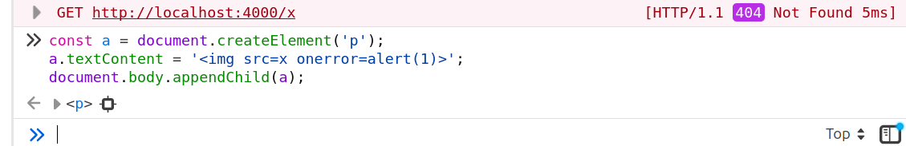
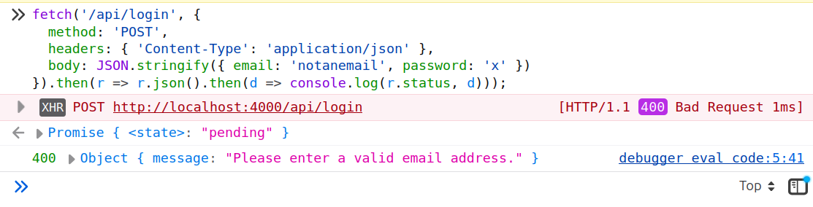

# Cybersecurity Risk Homework 2B
## Part 1
The first vulnerability is a classic SQL injection in the user field, which comments out anything past -- and returns the first user, the admin:





To fix this, queries need to be parameterized so input is treated as data, not SQL. Next, I showed the website is vulnerable to XSS, meaning I can execute code on it:



A fix is output encoding, so tags show as text, and CSP to block inline scripts. Lastly, a POST to /api/Users with "role": "admin" in the body created an admin account:



The fix is a server-side allow-list that drops fields like role. Passwords should be hashed with bcrypt so a leak doesn't expose them:

```js
const hash = bcrypt.hashSync(password, 10);       // on register
const ok = bcrypt.compareSync(password, hash);    // on login
```

# Part 2
I built a simple loginform with HTML and JS, using a small Express server over Node, hosting a SQLite DB. The form just has email and password, where the client has basic validation (not empty, contains @, password at least 8 chars) before being sent. The server does the same checks to prevent the same type of client-side bypasses as above. The DB only has a Users table, storing parameterized queries to prevent SQL injection like above; passwords are also hashed with bcrypt. Messages are shown with textContent instead of innerHTML, so injected HTML displays as plain text.

GitHub: https://github.com/philippzhuravlev/Assignment-2B

# Part 3

I tried to break my own form three ways. First, SQL injection with `x@x' OR 1=1 --`, which includes a "@" so it isn't rejected by the email validation. It still fails, since the parameterized query treats it as plain text instead of SQL:



Next I attempted an XSS attack through the console, setting textContent to the img onerror payload the same way my app does. The script doesn't run, and just displays as inert text:



Lastly, since client-side checks can be skipped, I called the API directly with an invalid email. The server validates again and rejects it:



None worked. Adding a CSP header would harden it further.
